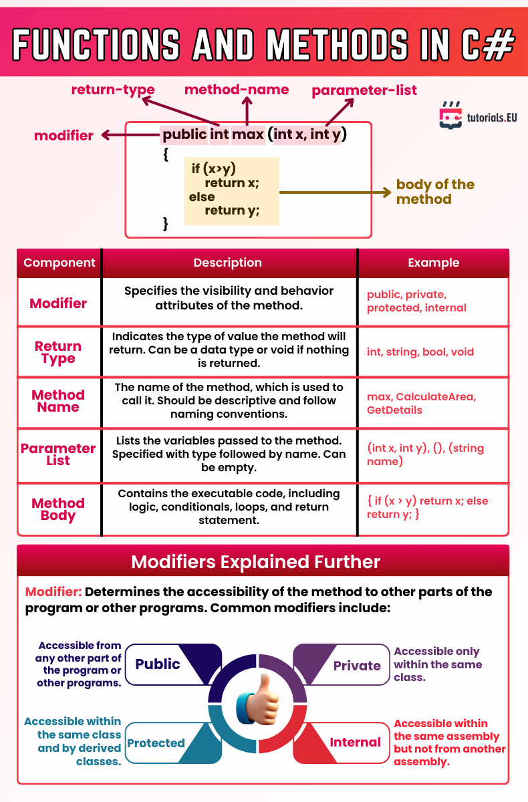

# Functions and Methods in C#

This cheatsheet provides a quick overview of how to define and understand methods in C#. It covers method structure, components like modifiers, return types, and parameter lists, as well as the purpose of different access modifiers.

---

## Key Method Components

- Modifier Defines method accessibility (e.g., `public`, `private`, `protected`, `internal`)
- Return Type Indicates what data type the method returns (`int`, `string`, `void`, etc.)
- Method Name The identifier used to call the method (e.g., `max`, `GetDetails`)
- Parameter List Variables passed to the method, specified as `(type name)`
- Method Body Contains the logic, conditionals, loops, and return statements

---

## Access Modifiers Explained

 Modifier    Accessibility                                                  
----------------------------------------------------------------------------
 `public`    Accessible from any part of the program or other programs      
 `private`   Accessible only within the same class                          
 `protected` Accessible within the same class and derived classes           
 `internal`  Accessible within the same assembly but not from other assemblies 

---

*Cheatsheet provided by [tutorials.EU](https://tutorials.eu)*  
*For educational use only. All rights belong to their respective creators.*

---

