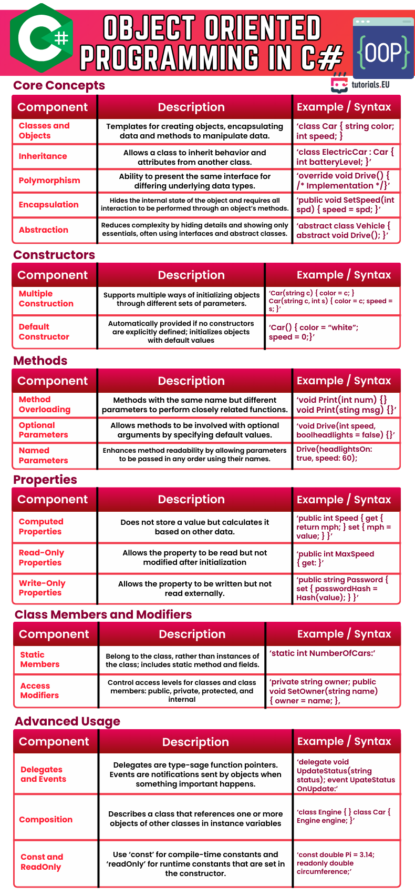

# Object Oriented Programming in C#

This cheat sheet provides a structured overview of the core concepts of Object-Oriented Programming (OOP) in C#, including inheritance, polymorphism, encapsulation, and abstraction. It also covers constructors, method features like overloading and optional parameters, property types, class modifiers, and advanced features like delegates, events, and composition.

---

*Cheatsheet provided by [tutorials.EU](https://tutorials.eu)*  
*For educational use only. All rights belong to their respective creators.*

---

