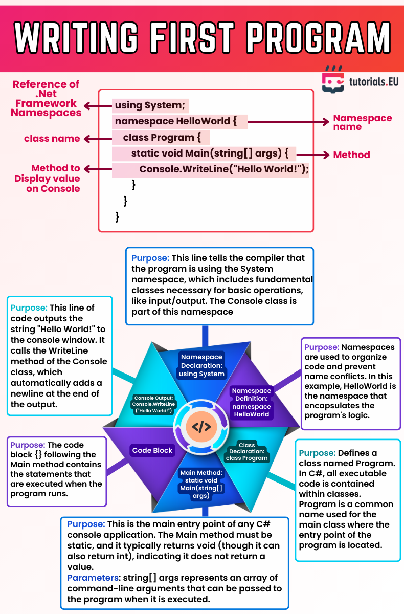

# Writing Your First Program

This cheat sheet explains the structure of a basic C# console application using the `Hello World` example.

It covers:
- Namespaces
- Classes and Methods
- The `Main` method
- Console output

---
This cheatsheet was created by tutorials.EU – all credit goes to the original author. Shared here for learning purposes only.

