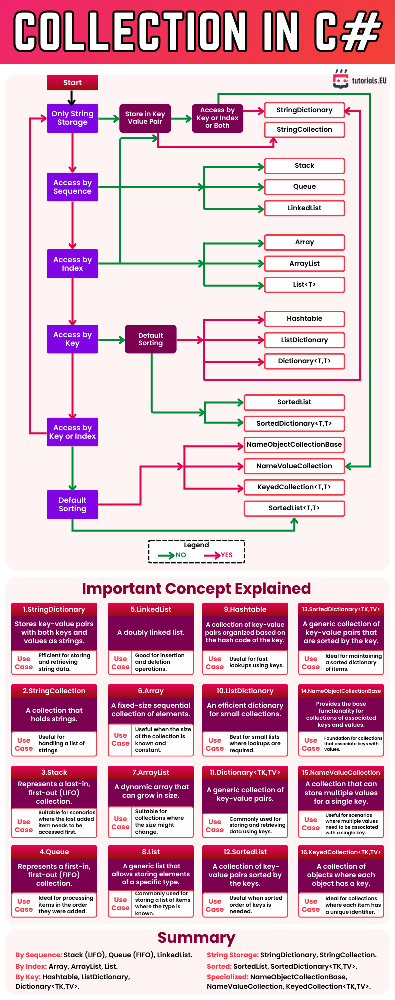

# Collections in C#

This cheatsheet summarizes the main types of collections available in C#, grouped by usage patterns like string storage, sequence/index/key access, and sorting. The flowchart guides your decision on which collection type best fits your needs, while the concept list offers short definitions and use cases.

---

*Cheatsheet provided by [tutorials.EU](https://tutorials.eu)*  
*For educational use only. All rights belong to their respective creators.*

---

