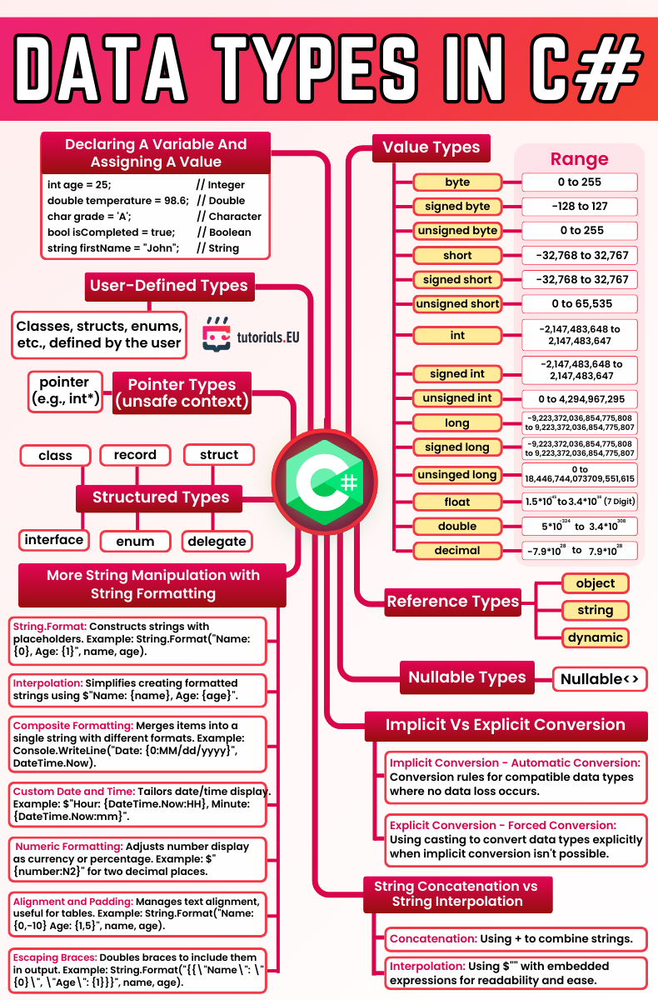

# C# Cheat Sheet – Data Types Overview

This cheatsheet provides a comprehensive overview of **data types in C#**, both **value types** (such as `int`, `float`, `bool`) and **reference types** (like `string`, `object`, and `dynamic`). It also covers **nullable types**, **pointer types**, and **user-defined structured types** (`class`, `struct`, `enum`, etc.).

In addition, this sheet includes practical examples of **declaring variables**, using **string formatting** and **interpolation**, and understanding **type conversion** between data types.

Use this as a quick reference for:
- Recognizing the range and purpose of each type
- Formatting output effectively
- Handling different type conversions
- Writing more readable and maintainable C# code

_This material complements the early sections of the course and helps reinforce key concepts as you start writing real programs._

---

*Cheatsheet provided by [tutorials.EU](https://tutorials.eu)*  
*For educational use only. All rights belong to their respective creators.*

---

