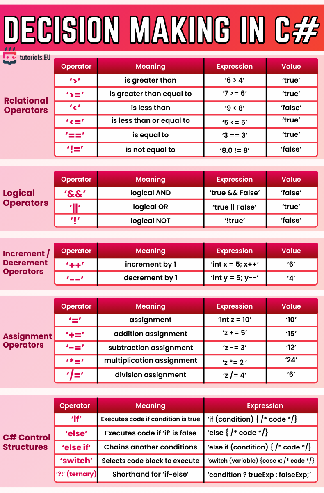

# 🧠 Decision Making in C#

This cheatsheet provides an overview of decision-making fundamentals in C#. It includes relational and logical operators, increment and decrement syntax, assignment variations, and core control structures like `if`, `else`, `switch`, and ternary operations. It's designed to help you write conditional logic clearly and effectively in your C# programs.

---
### 📌 Covered Topics:
- **Relational Operators**: Compare values (e.g., `>`, `<`, `==`)
- **Logical Operators**: Combine conditions (e.g., `&&`, `||`, `!`)
- **Increment / Decrement Operators**: Adjust variable values (`++`, `--`)
- **Assignment Operators**: Modify and assign values (`+=`, `*=`, etc.)
- **Control Structures**: Use `if`, `else`, `else if`, `switch`, and ternary (`? :`) to direct program flow

> ⚠️ Tip: Mastering these will help you implement decision logic in nearly every C# application.

---

*Cheatsheet provided by [tutorials.EU](https://tutorials.eu)*  
*For educational use only. All rights belong to their respective creators.*

---

