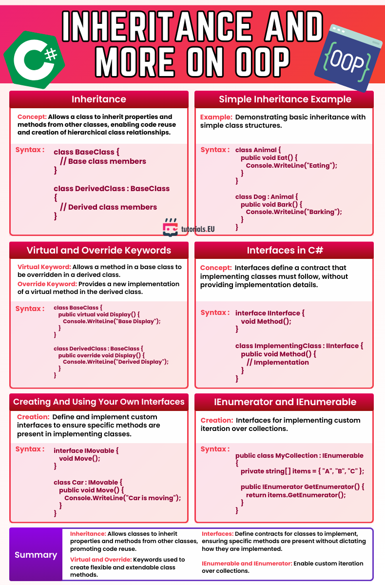

# Inheritance and More on OOP – Cheatsheet

This cheatsheet summarizes key concepts of object-oriented programming (OOP) in C#, focusing on **inheritance**, **interfaces**, the use of the **virtual** and **override** keywords, and how to implement custom iteration with `IEnumerable` and `IEnumerator`. It provides syntax examples and clarifies the differences between inheritance and interfaces, as well as the importance of contracts in C# programming.

---

*Cheatsheet provided by [tutorials.EU](https://tutorials.eu)*  
*For educational use only. All rights belong to their respective creators.*

---

