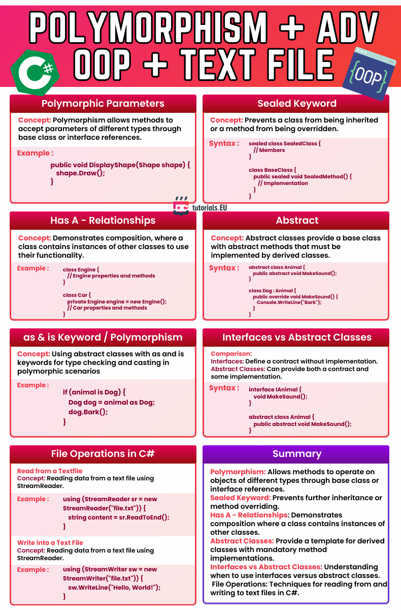

# Polymorphism + Advanced OOP + Text File Operations in C#

This cheatsheet summarizes advanced object-oriented programming topics in C#, including:
- Polymorphism with base classes and interfaces
- Sealed and abstract classes
- "Has-A" relationships (composition)
- The `as` and `is` keywords for type checking and casting
- Comparison between interfaces and abstract classes
- Reading and writing text files in C#

**Summary of Concepts:**
- **Polymorphism:** Allows methods to operate on objects of different derived types through a common interface or base class reference.
- **Sealed keyword:** Prevents a class from being inherited or a method from being overridden.
- **Composition:** Demonstrates how a class can contain and use instances of other classes ("has-a" relationship).
- **Abstract Classes:** Require derived classes to implement specific methods.
- **Interfaces vs Abstract Classes:** Interfaces define contracts with no implementation; abstract classes can include both abstract and concrete members.
- **Type Checking:** Use `is` for checking and `as` for safe casting.
- **File Operations:** Basic reading from and writing to text files in C# using `StreamReader` and `StreamWriter`.

---

