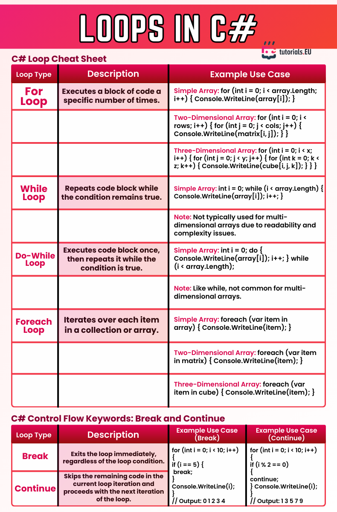

# Loops in C#

This cheatsheet provides a quick reference to the various types of loops in C# and how to use them. Loops are fundamental in programming as they allow repeated execution of code blocks based on conditions or collections.

It includes examples for:
- `for`, `while`, `do-while`, and `foreach` loops
- Handling arrays and multi-dimensional arrays
- Use of `break` and `continue` statements for controlling flow inside loops

Use this as a visual and practical guide for mastering iteration in C#.

---

*Cheatsheet provided by [tutorials.EU](https://tutorials.eu)*  
*For educational use only. All rights belong to their respective creators.*

---

